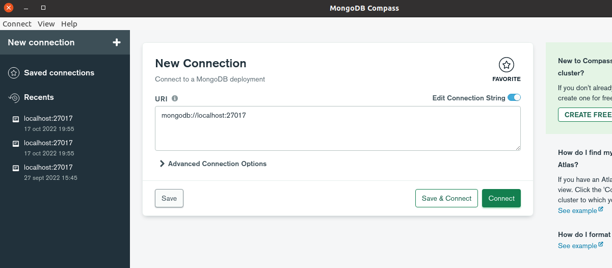
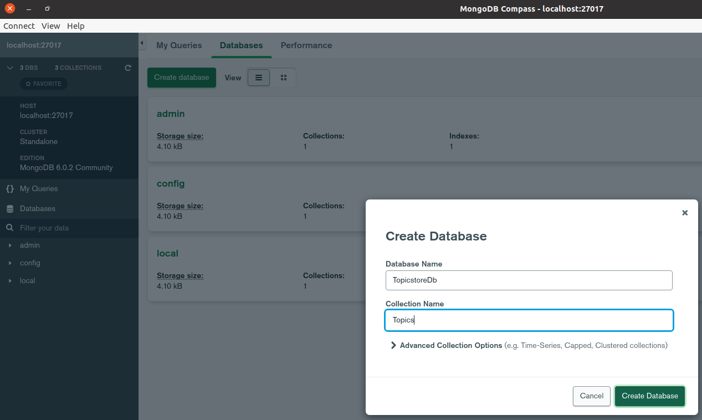
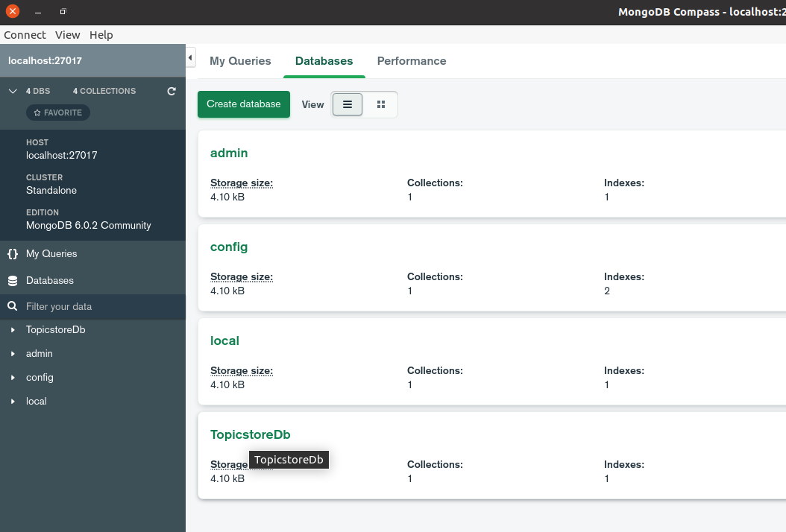
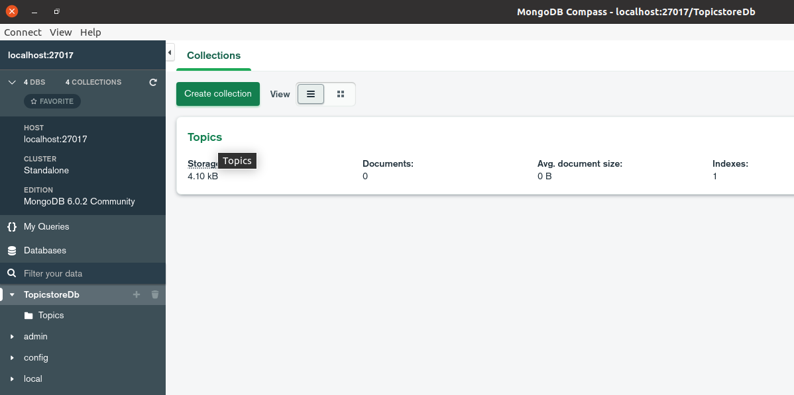
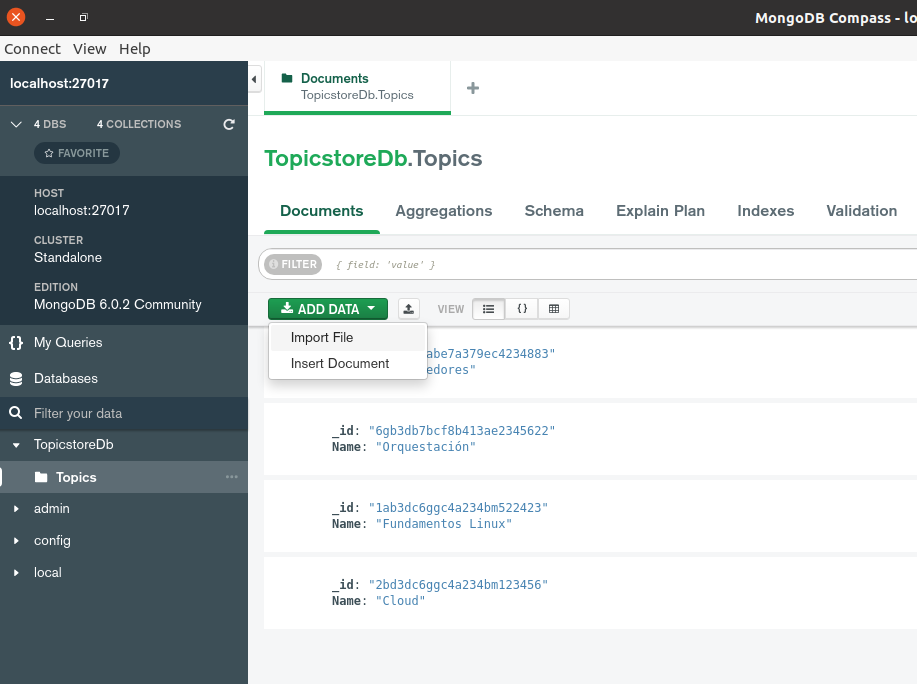
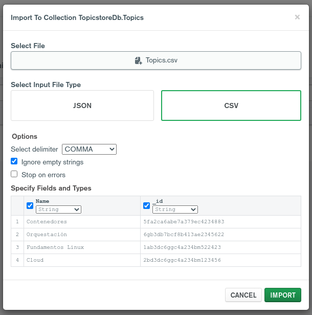
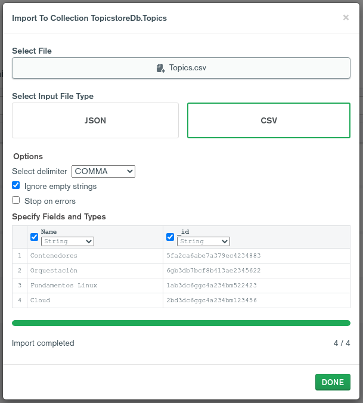
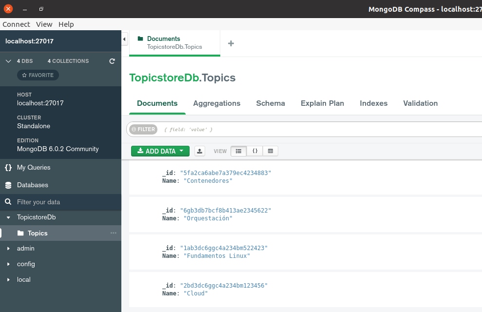
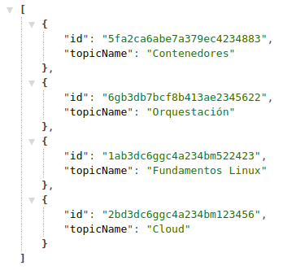
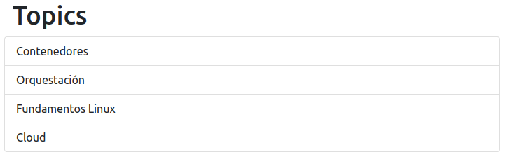

# Mi solución al reto de Lemoncode

## Ejercicio 1

> *Dockeriza la aplicación dentro de lemoncode-challenge, la cual está compuesta de 3 partes:*
> 
> - Un front-end con Node.js
> - Un backend en .NET que utiliza un MongoDB para almacenar la información.
> - El MongoDB donde se almacena la información en una base de.
> 
> Requisitos del ejercicio:
> 
> 1. Los tres componentes deben estar en una red llamada lemoncode-challenge.
> 2. El backend debe comunicarse con el mongodb a través de esta URL mongodb://some-mongo:27017
> 3. El front-end debe comunicarse con la api a través de http://topics-api:5000/api/topics
> 4. El front-end debe estar mapeado con el host para ser accesible a través del puerto 8080.
> 5. El MongoDB debe almacenar la información que va generando en un volumen, mapeado a la ruta /data/db.
> 6. Este debe de tener una base de datos llamada TopicstoreDb con una colección llamada Topics. La colección Topics debe tener esta estructura: `("_id"x"Soid":"5fa2ca6abe7a379ec4234883"),"Name":"Contenedores")` ¡Añade varios registros!
> 
> Tip para backend: Antes de intentar contenerizar y llevar a cabo todos los pasos del ejercicio se recomienda intentar ejecutar la aplicación sin hacer cambios en ella. En este caso, lo único que es posible que “no tengamos a mano” es el MongoDB. Por lo que empieza por crear este en Docker, usa un cliente como el que vimos en el primer día de clase (MongoDB Compass) para añadir datos que pueda devolver la API.

### Pasos a seguir

#### Crear la red


```sh
# Creamos la red para la aplicación
docker network create lemoncode-challenge
```

#### Crear volumen y base de datos

```sh
# Creamos el volumen para la base de datos
docker volume create --name=some-mongo-volume

# Creamos el contenedor de la base de datos (mongoDB)
docker run -d --name some-mongo \
    -p 27017:27017 \
    --network lemoncode-challenge \
    -v some-mongo-volume:/data/db \
    mongo

# En producción se recomienda usar un usuario con password, pero no lo añado porque requiere más cambios en el servidor dotnet
#    -e MONGO_INITDB_ROOT_USERNAME=mongoadmin \
#    -e MONGO_INITDB_ROOT_PASSWORD=secret \

# He usado Mongodb Compass con usuario mongoadmin y contraseña secret 
# Creado la base de datos con Database Name "TopicstoreDb" y la Collection Name "Topics"
# Y añadido desde la herramienta algunos ejemplos de datos. 
# Adjunto capturas de pantalla de los pasos.
```

Registros agregados en el fichero Topics.csv:

```csv
Name,_id
Contenedores,5fa2ca6abe7a379ec4234883
Orquestación,6gb3db7bcf8b413ae2345622
Fundamentos Linux,1ab3dc6ggc4a234bm522423
Cloud,2bd3dc6ggc4a234bm123456
```

1. Conectarse a Mongo con DB Compass:

  

2. Crear Database y Collection:

  

3. Click en TopicstoreDb Database:

  

4. Click en Topics Collection:



5. Click en `ADD_DATA` > `Import_File`:



6. Click en `IMPORT` para añadir datos tras seleccionar CSV y el fichero `Topics.csv`:



7. Click en `DONE` tras completar proceso:



8. Comprobar listado de documentos importados:



También he añadido la opción con un JSON como alternativa.

### Opción dotnet

#### Crear servidor backend (opción dotnet)

Definir una imagen del servidor backend en dotnet que usará el código de `dotnet-stack/backend` mediante la creación de un nuevo fichero `./dotnet-stack/backend/Dockerfile`:

```dockerfile
FROM amd64/buildpack-deps:bullseye-scm

ENV \
    # Do not generate certificate
    DOTNET_GENERATE_ASPNET_CERTIFICATE=false \
    # Enable detection of running in a container
    DOTNET_RUNNING_IN_CONTAINER=true \
    # Enable correct mode for dotnet watch (only mode supported in a container)
    DOTNET_USE_POLLING_FILE_WATCHER=true \
    # Skip extraction of XML docs - generally not useful within an image/container - helps performance
    NUGET_XMLDOC_MODE=skip \
    # PowerShell telemetry for docker image usage
    POWERSHELL_DISTRIBUTION_CHANNEL=PSDocker-DotnetCoreSDK-Debian-11

# Install .NET CLI dependencies
RUN apt-get update \
    && apt-get install -y --no-install-recommends \
        libc6 \
        libgcc1 \
        libgssapi-krb5-2 \
        libicu67 \
        libssl1.1 \
        libstdc++6 \
        zlib1g \
    && rm -rf /var/lib/apt/lists/*

# Install .NET Core SDK
RUN sdk_version=3.1.424 \
    && curl -fSL --output dotnet.tar.gz https://dotnetcli.azureedge.net/dotnet/Sdk/$sdk_version/dotnet-sdk-$sdk_version-linux-x64.tar.gz \
    && dotnet_sha512='5f9fc353eb826c99952582a27b31c495a9cffae544fbb9b52752d2ff9ca0563876bbeab6dc8fe04366c23c783a82d080914ebc1f0c8d6d20c4f48983c303bf18' \
    && echo "$dotnet_sha512  dotnet.tar.gz" | sha512sum -c - \
    && mkdir -p /usr/share/dotnet \
    && tar -oxzf dotnet.tar.gz -C /usr/share/dotnet \
    && rm dotnet.tar.gz \
    && ln -s /usr/share/dotnet/dotnet /usr/bin/dotnet \
    # Trigger first run experience by running arbitrary cmd
    && dotnet help

WORKDIR /App
COPY . ./
EXPOSE 5000

CMD dotnet run
```

Y el fichero `.dockerignore` para no incluir código no necesario, con el siguiente contenido:

```
bin/
obj/
```

Construir la imagen con el siguiente comando:

```sh
# Y construirlo con el nombre topics-api:
cd dotnet-stack/backend/ ; docker build -t topics-api .
```

Y arrancar un contenedor con dicha imagen:

```sh
# Y arrancarlo:
docker run -d --name topics-api \
    -p 5000:5000 \
    --network lemoncode-challenge \
    topics-api
```

Si accedemos a http://localhost:5000/api/topics debería devolvernos un JSON como el siguiente:



#### Crear servidor frontend (opción dotnet)

Creamos el fichero `dotnet-stack/frontend/Dockerfile` con el siguiente contenido:

```dockerfile
FROM node:14-alpine

ENV NODE_ENV=production

WORKDIR /usr/src/app

COPY ["package.json", "package-lock.json*", "server.js", "views", "./"]

RUN npm install --production --silent

COPY . .

EXPOSE 3000

RUN chown -R node /usr/src/app

USER node

CMD ["npm", "start"]
```

Y generamos la imagen:

```sh
# Generar la imagen:
cd dotnet-stack/frontend/ ; docker build -t lemoncode-challenge-frontend .
```

Crear un contenedor con la imagen creada:

```sh
# La ejecutamos en la red lemoncode-challenge
docker run -d --name lemoncode-challenge-frontend --network lemoncode-challenge -e API_URI=http://topics-api:5000/api/topics -p 8080:3000 lemoncode-challenge-frontend
```

Visitar http://localhost:8080/

Deberíamos ver una página como la siguiente:



### Opción node

#### Crear servidor backend (opción node)

Definir una imagen del servidor backend en dotnet que usará el código de `node-stack/backend` mediante la creación de un nuevo fichero `./node-stack/backend/Dockerfile`:

```dockerfile
FROM node:lts-alpine
ENV NODE_ENV=production
WORKDIR /usr/src/app
COPY [".env.template", "package.json", "package-lock.json", "src", "tsconfig.json", "./"]
RUN npm install --production=false
RUN npm run build 
COPY node_modules .
COPY dist .
EXPOSE 5000
RUN chown -R node /usr/src/app
USER node
CMD ["npm", "exec", "node", "./dist/app.js"]
```

Construir la imagen con el siguiente comando:

```sh
# Entramos en el directorio donde hemos creado el fichero Dockerfile:
cd node-stack/backend/
# Y construirlnodeo con el nombre topics-api:
docker build -t topics-api .
```

Y arrancar un contenedor con dicha imagen:

```sh
# Y arrancarlo:
docker run -d --name topics-api \
    -p 5000:5000 \
    --network lemoncode-challenge \
    topics-api
```

Podemos comprobar que todo ha ido bien accediendo a http://localhost:5000/api/topics

...peeero me ha dado errores al transpilar el código de typescript a javascript:

```
src/services/mappers.ts:41:19 - error TS2349: This expression is not callable.
  Each member of the union type '(<U>(callbackfn: (value: TopicDatabase, index: number, array: TopicDatabase[]) => U, thisArg?: any) => U[]) | (<U>(callbackfn: (value: Topic, index: number, array: Topic[]) => U, thisArg?: any) => U[])' has signatures, but none of those signatures are compatible with each other.

41     return topics.map(mapTopic);
                     ~~~


Found 1 error.
```

### Limpieza (paso opcional)

Añado los pasos para aplicar una limpieza de los datos si se quiere volver a aplicar los pasos de mi solución en limpio.

Los utilizo para asegurarme de que son necesarios exactamente los pasos que he definido y de que no me olvido ninguno.

```sh
# Borrado de la red creada para la aplicación
docker network rm lemoncode-challenge
# Parar y borrar el contenedor de mongo
docker stop some-mongo
docker rm some-mongo
# Borrado del volumne para la base de datos
docker volume rm some-mongo-volume
# Borrado del contenedor topics-api (dotnet)
docker stop topics-api
docker rm topics-api
# Borrado de la imagen topics-api (dotnet)
docker image rm topics-api:latest
# Borrado del contenedor lemoncode-challenge-frontend
docker stop lemoncode-challenge-frontend
docker rm lemoncode-challenge-frontend
# Borrado de la imagen lemoncode-challenge-frontend
docker image rm lemoncode-challenge-frontend
# Fin de los pasos
```

---

## Ejercicio 2

> *Ahora que ya tienes la aplicación del ejercicio 1 dockerizada, utiliza Docker Compose para lanzar todas las piezas a través de este. Debes plasmar todo lo necesario para que esta funcione como se espera: la red que utilizan, el volumen que necesita MongobDB, las variables de entorno, el puerto que expone la web y la API. Además debes indicar qué comandos utilizarías para levantar el entorno, pararlo y eliminarlo.*

### Pasos a seguir

Tras seguir los pasos del ejercicio 1 (pero sin la limpieza opcional) creamos un archivo `docker-compose.yml` con el siguiente contenido:

```yaml
version: '3.4'
services:
  some-mongo:
    image: mongo:latest
    ports:
      - 27017:27017
    volumes:
      - somo-mongo-volume:/data/db
    networks:
      - lemoncode-challenge
  topics-api:
    image: topics-api:latest
    ports: 
      - 5000:5000
    networks:
      - lemoncode-challenge
  lemoncode-challenge-frontend:
    depends_on:
      - some-mongo
      - topics-api
    image: lemoncode-challenge-frontend:latest
    ports:
      - 8080:3000
    environment:
      - API_URI=http://topics-api:5000/api/topics
    networks:
      - lemoncode-challenge
networks:
  lemoncode-challenge:
    driver: "bridge"
volumes:
  somo-mongo-volume:
```

Y ejecutamos el siguiente comando para arrancar los contenedores definidos en el fichero `docker-compose.yml`:

```sh
docker-compose up -d
```

Y comprobamos que todo está funcionando accediendo a http://localhost:8080/ con el navegador.

Para ver el listado de topics hará falta alimentar la base de datos que se ha creado en el contenedor de mongo. 

Se puede utilizar mongo-cli, con el siguiente comando:

```sh
mongo-cli -d TopicstoreDb -c Topics --eval "db.Topics.insertMany([{_id: '5fa2ca6abe7a379ec4234883',Name: 'Contenedores'},{_id: '6gb3db7bcf8b413ae2345622',Name: 'Orquestación'},{_id: '1ab3dc6ggc4a234bm522423',Name: 'Fundamentos Linux'},{_id: '2bd3dc6ggc4a234bm123456',Name: 'Cloud'}]"
``` 

o mongosh:

```
test> use TopicstoreDb
test> db.Topics.insertMany([{_id: '5fa2ca6abe7a379ec4234883',Name: 'Contenedores'},{_id: '6gb3db7bcf8b413ae2345622',Name: 'Orquestación'},{_id: '1ab3dc6ggc4a234bm522423',Name: 'Fundamentos Linux'},{_id: '2bd3dc6ggc4a234bm123456',Name: 'Cloud'}]
```

pero no sé si se quiere tener siempre el mismo conjunto de datos al arrancar el contenedor de mongo :confused: Opté por importar los datos con Compass.

Utilicé las imágenes y no la opción de `build: context: ./...` para que el mismo dockerfile me sirviera para la opción node.

### Limpieza (paso opcional)

Añado los pasos para aplicar una limpieza de los datos si se quiere volver a aplicar los pasos de mi solución en limpio.

Los utilizo para asegurarme de que son necesarios exactamente los pasos que he definido y de que no me olvido ninguno.

```sh
# Parar y eliminar contenedores del lemoncode-challenge
docker-compose down
# Borrado de la red creada para la aplicación
docker network rm lemoncode-challenge
# Borrado del volumne para la base de datos
docker volume rm some-mongo-volume
```